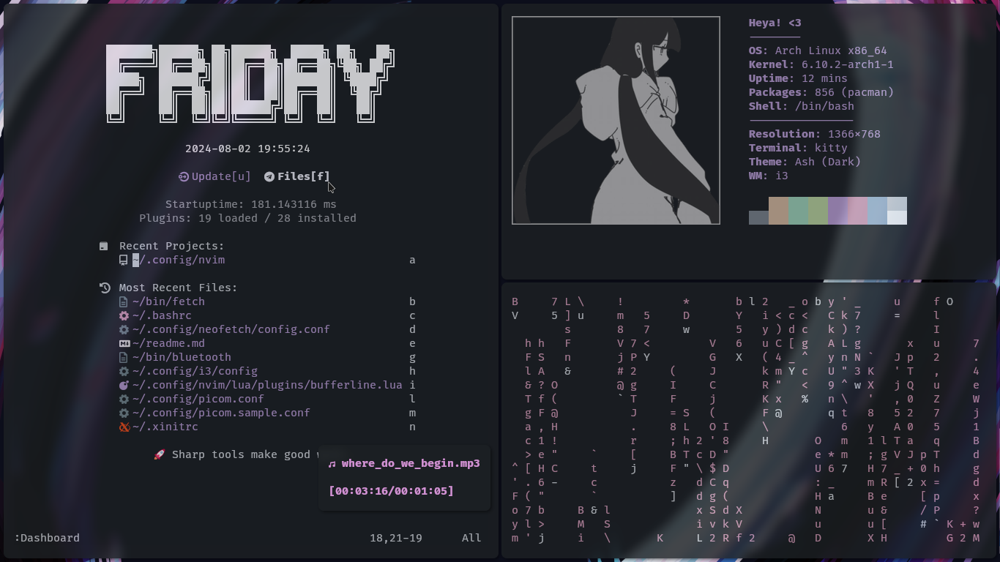

## Dotfiles


**Theme:** Ashes (Dark)<br>
**Terminal:** Kitty<br>
**Editor:** Neovim w/ Lazy.nvim (_180ms startup time_)<br>
**Cursor Theme:** Capitaine Cursors<br>
**Font:** Fira Code Nerd Font<br>
**Shell:** Bash<br>
**WM:** i3<br>

---
### Features:

|FZF Dmenu|Music Player|
|---------|------------|
|||


#### Useful I3 Keybinds:
|Key|Action|
|:--|:-----|
|`mod d`|Dmenu|
|`mod n`|Open neovim in a new terminal|
|`mod enter`|Open a terminal|
|`mod m`|Open music player|
|`mod b`|Connect to bluetooth device|
|`mod q`|Kill current window|
|`mod shift up`|Brightness up|
|`mod shift down`|Brightness down|
|`mod p`|Take a screenshot and save to ~/media/screenshots|
|`mod shift -`|Move window to scratchpad|
|`mod -`|Show scratchpad windows|

#### Useful Neovim Keybinds:
|key|Action|
|:--|:-----|
|`<C-,>`|Open a floating terminal|
|`<S-u>`|Toggle file explorer|
|`<Tab>`|Next buffer/tab|
|`<S-Tab>`|Previous buffer/tab|
|`<C-Up>`|Add cursor above|
|`<C-Down>`|Add cursor below|
|`:CarbonNowSh`|Open the selected code in [carbon.now.sh](https://carbon.now.sh)|


### [!] Important Stuff:

---

**[!]** I use the [pijulius/picom](https://github.com/pijulius/picom) fork of picom for animation support. Using another fork will likely break the [picom configuration](.config/picom.conf). please note that picom is not listed in the dependencies for this reason.

**[!]** You might have to define the mac address of your bluetooth device in `bin/bluetooth`, or disable the keybind and script altogether if you don't want to use it.

**[!]** These dotfiles are configured using a 1366x768 screen resolution, other resolutions haven't been tested. Use at your own discretion. 

---

### Installation:

#### Dependencies:
```
yay -S xorg xorg-server xorg-init ly brightnessctl i3 feh autotiling kitty yadm neovim luarocks fzf mpv ttf-firacode-nerd capitaine-cursors bluez tclock cmatrix colorpicker peek neofetch
```

I probably forgot a few things.

after installing the dependencies, just run the following:
```
yadm clone https://github.com/lu-sife/dotfiles.git
```

if you have existing dotfiles, you can overwrite them with:
```
yadm fetch --all &&
yadm reset --hard origin/master
```

---
