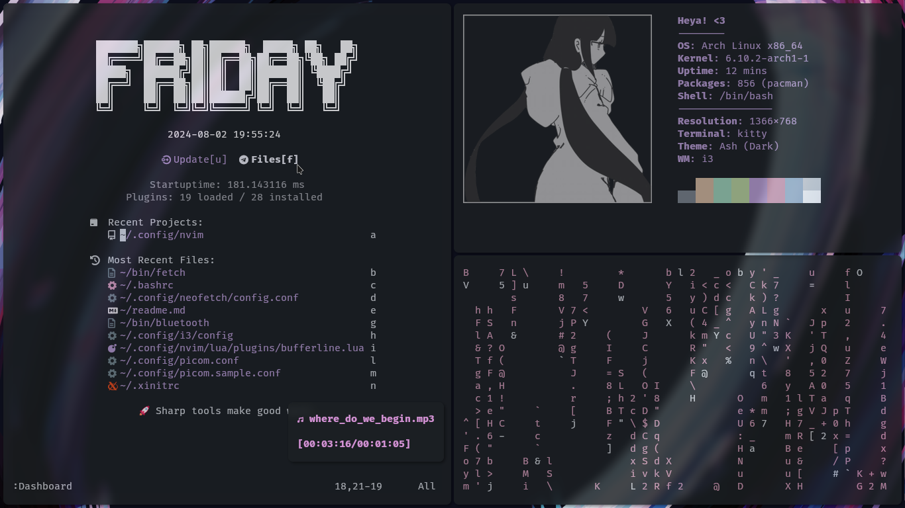
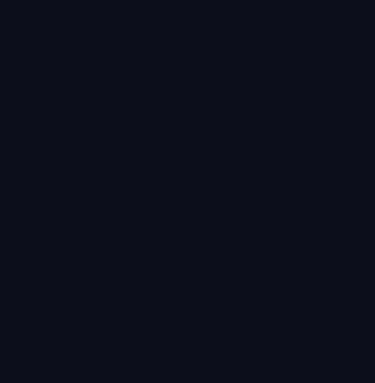

## Dotfiles


**Theme:** Ashes (Dark)<br>
**Terminal:** Kitty<br>
**Editor:** Neovim w/ Lazy.nvim (_180ms startup time_)<br>
**Cursor Theme:** Capitaine Cursors<br>
**Font:** Fira Code Nerd Font<br>
**Shell:** Bash<br>
**WM:** i3<br>

**[!]** These dotfiles are configured using a 1366x768 screen resolution, other resolutions haven't been tested. Use at your own discretion. 

---
### Features:

|FZF Dmenu|Music Player|
|---|---|
|||


#### Useful I3 Keybinds:
|Key|Action|
|-|-|
|`mod+d`|Dmenu|
|`mod+n`|Open neovim in a new terminal|
|`mod+enter`|Open a terminal|
|`mod+m`|Open music player|
|`mod+b`|Connect to bluetooth device (_define a mac address in bin/bluetooth_)|
|`mod+q`|Kill current window|
|`mod+shift+up`|brightness up|
|`mod+shift+down`|brightness down|
|`mod+p`|take a screenshot and save to ~/media/screenshots|
|`mod+shift+-`|move window to scratchpad|
|`mod+-`|show scratchpad windows|

#### Useful Neovim Keybinds:
|key|Action|
|---|------|
|`<C-,>`|Open a floating terminal|
|`<S-u>`|Toggle file explorer|
|`<Tab>`|Next buffer/tab|
|`<S-Tab>`|Previous buffer/tab|
|`<C-Up>`|Add cursor above|
|`<C-Down>`|Add cursor below|
|`:CarbonNowSh`|Open the selected code in [carbon.now.sh](https://carbon.now.sh)|


### Installation:

---

#### Dependencies:
```
yay -S xorg xorg-server xorg-init ly brightnessctl i3 feh autotiling kitty yadm neovim luarocks fzf mpv ttf-firacode-nerd capitaine-cursors bluez tclock cmatrix colorpicker peek
```

**[!]** picom is also a dependency, but requires the [pijulius/picom](https://github.com/pijulius/picom) fork of picom for animation support. Using another fork will likely break the [picom configuration](.config/picom.conf).

after installing the dependencies, just run `yadm clone https://github.com'lu-sife/dotfiles.git`<br>
if you have existing dotfiles, you can overwrite them with `yadm fetch --all` and `yadm reset --hard origin/master`
